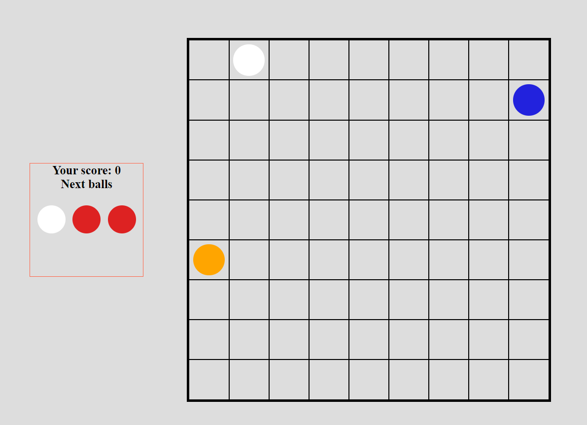
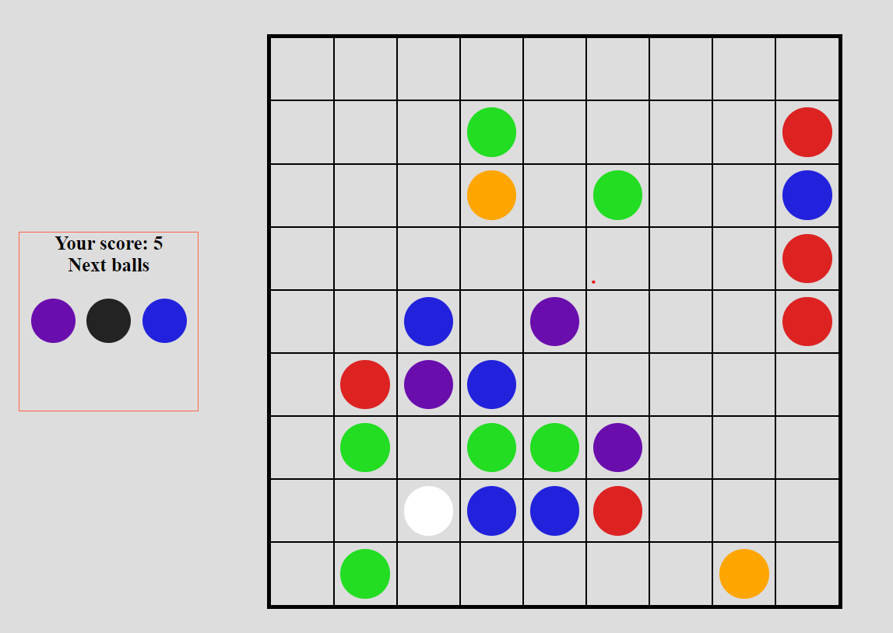
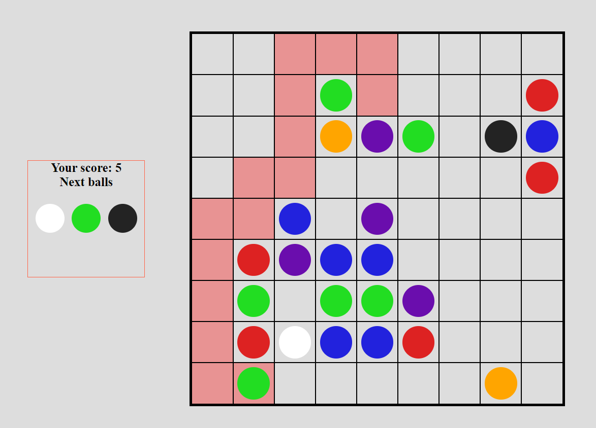

# 🎮⚽ **Ball Game** ⚽🎮
## Classic internet game in a form of **web application**.
## 📱 Works also on mobile devices!
## How to play?
- place 5 balls of the same color in a row/column/diagonally
- score 1 point for each popped ball
- how far can you get❔

### Launch the application on local machine:  
1. Enter project directory
2. Launch localserver 
3. Enjoy the game 😊

### 🤖 **Technologies**
- [x] TypeScript
- [x] Webpack

### 🖼️ **Images of the game** 

